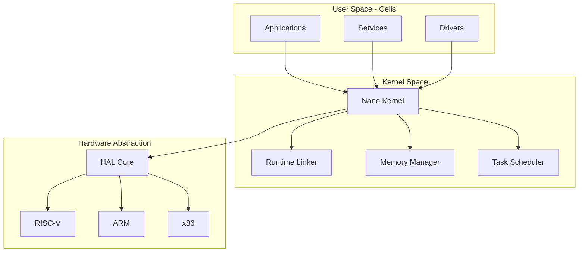
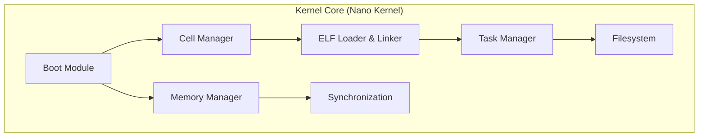
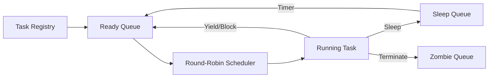
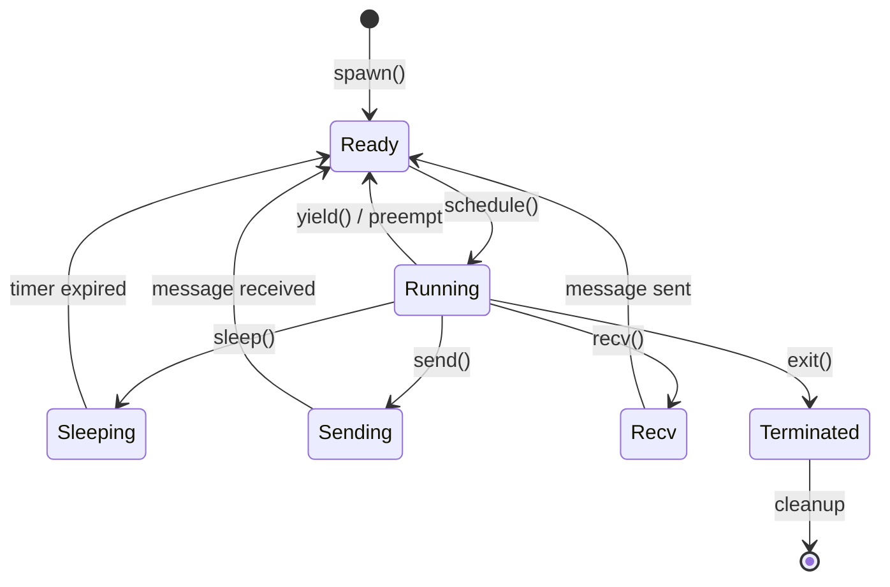
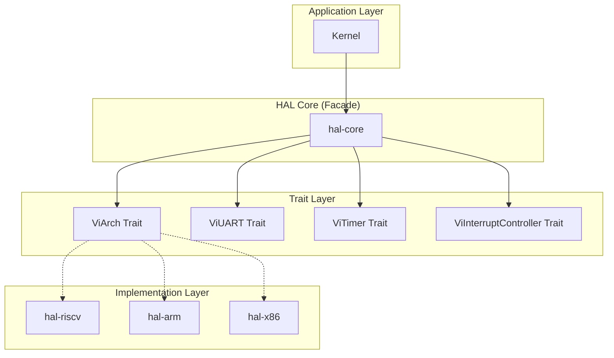
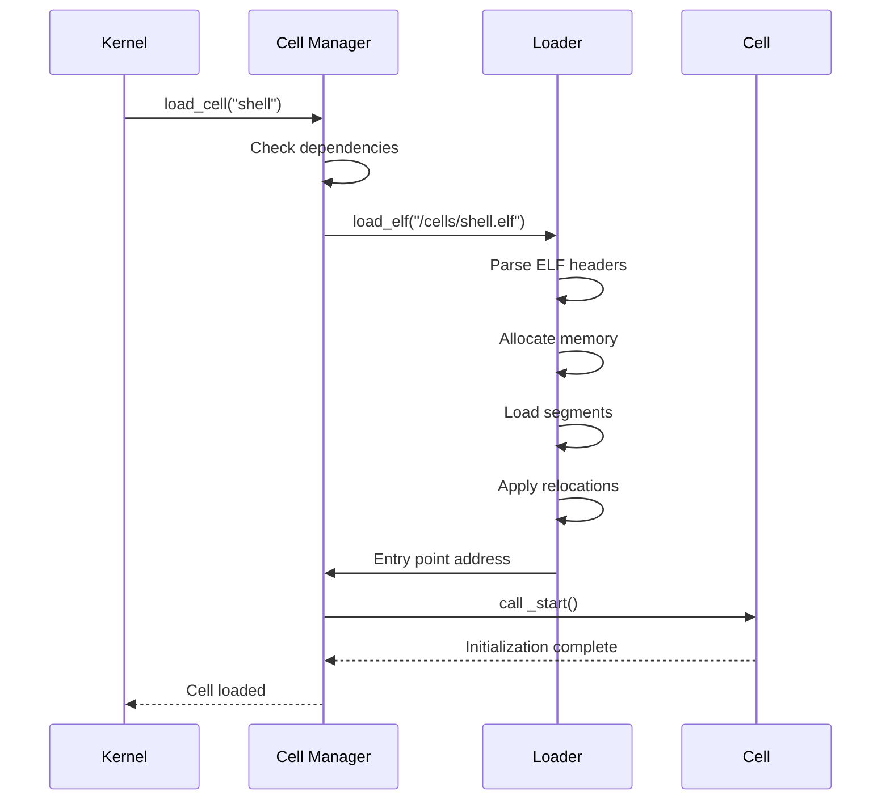
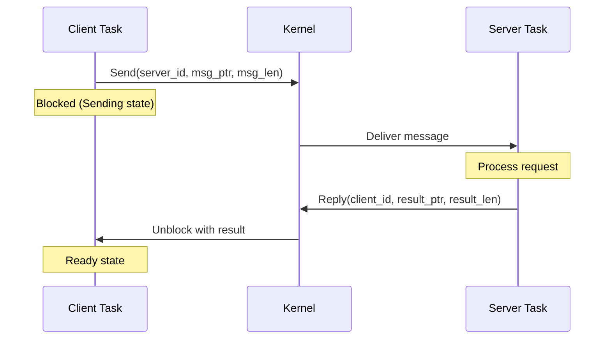
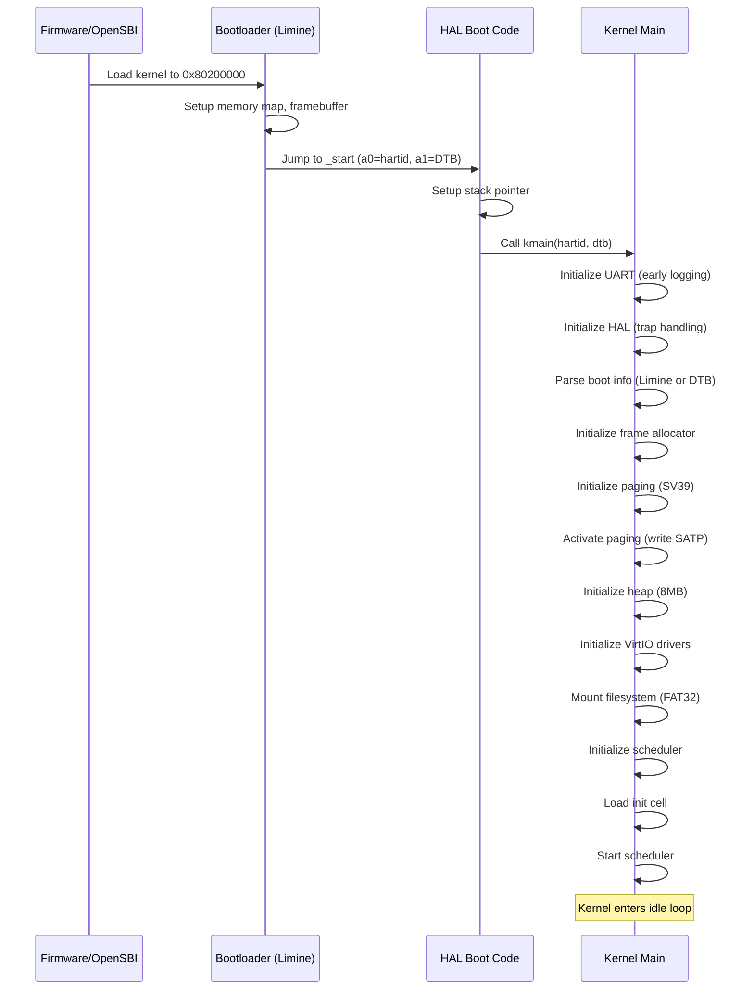

# ViOS (Jarvis Hybrid OS) Architecture

> **Complete technical architecture documentation for ViOS - A next-generation Cellular Operating System for the Edge-to-Cloud era**

## Table of Contents

1. [Architecture Overview](#-architecture-overview)
2. [System Philosophy](#-system-philosophy)
3. [Core Components](#-core-components)
4. [Memory Architecture](#-memory-architecture)
5. [Task Management](#-task-management)
6. [Hardware Abstraction Layer](#-hardware-abstraction-layer)
7. [Cell Architecture](#-cell-architecture)
8. [IPC and Communication](#-ipc-and-communication)
9. [Driver Model](#-driver-model)
10. [Boot Process](#-boot-process)
11. [Security Architecture](#-security-architecture)
12. [Architecture Decision Records](#-architecture-decision-records)

---

## 📐 Architecture Overview

**ViOS** is a revolutionary operating system that abandons traditional process-based designs in favor of a **Cellular Single Address Space (SAS)** architecture with **Language-Based Isolation (LBI)**.

### System Diagram



### Key Characteristics

| Property | Value |
|----------|-------|
| **Architecture Style** | Cellular, Single Address Space (SAS) |
| **Isolation Method** | Language-Based Isolation (LBI) via Rust |
| **Primary Language** | Rust (2021 edition, nightly) |
| **Kernel Type** | Nano kernel (~7000 LOC) |
| **Target Architectures** | RISC-V (primary), ARM, x86/x86_64 |
| **Build System** | Cargo workspace |
| **Bootloader** | Limine, OpenSBI (RISC-V) |
| **IPC Model** | Hubris-inspired (Send/Recv/Reply/Lend/Grant) |

---

## 🎯 System Philosophy

### The Paradigm Shift

**Traditional OS** (Linux/Unix):
- Process-based isolation (hardware MMU)
- Context switches between address spaces
- Heavy overhead for IPC
- Security via hardware protection

**ViOS** (Cellular SAS):
- Cell-based isolation (language-level safety)
- Single shared address space
- Zero-copy IPC via ownership transfer
- Security via type system and borrow checker

### Core Principles

#### 1. **Cellular Architecture**
- Software organized as **Cells** (independent, dynamically-loadable units)
- Each Cell is compiled separately (.o files)
- Cells can be Native Rust, WASM, or even sandboxed C/C++
- No traditional "process" concept

#### 2. **Single Address Space (SAS)**
- All Cells share one virtual address space
- No address space switches during IPC
- Identity mapping for kernel simplicity
- Future: Higher-half kernel mapping

#### 3. **Language-Based Isolation (LBI)**
- Rust's type system provides memory safety
- Cells compiled with `#![forbid(unsafe_code)]`
- Kernel uses unsafe only for hardware interaction
- Borrow checker prevents data races

#### 4. **Zero-Copy IPC**
- Ownership transfer instead of data copying
- **Lease**: Temporary zero-copy buffer sharing
- **Grant**: Permanent buffer transfer
- **Owned Buffers Rule**: Use `Box<[u8]>` not `&mut [u8]`

---

## 🏗️ Core Components

### Component Architecture



### 1. Boot Module (`kernel/src/boot/`)

**Purpose**: Initialize kernel from bootloader handoff

**Responsibilities**:
- Parse Limine protocol responses or OpenSBI Device Tree
- Extract memory map, framebuffer, kernel base address
- Provide unified `BootInfo` trait for architecture-independent startup
- Handle HHDM (Higher Half Direct Mapping) offset resolution

**Key Files**:
- `boot.rs`: Main bootloader interface and fallback handling
- `boot/limine.rs`: Limine protocol parser

**Dependencies**: HAL (for OpenSBI/DTB parsing on RISC-V)

**Interfaces**:
```rust
pub trait BootInfo {
    fn memory_map(&self) -> &[MemoryEntry];
    fn framebuffer(&self) -> Option<Framebuffer>;
    fn kernel_base(&self) -> VAddr;
}
```

---

### 2. Cell Manager (`kernel/src/cell/`)

**Purpose**: Manage Cell metadata, lifecycle, and dependency resolution

**Responsibilities**:
- Register Cells in global registry
- Track Cell dependencies (DAG)
- Validate Cell versions (SemVer)
- Handle Cell loading/unloading
- Maintain Cell state (Loaded, Running, Stopped)

**Key Structures**:
```rust
pub struct CellMetadata {
    pub id: CellId,
    pub name: String,
    pub version: SemVer,
    pub entry_point: VAddr,
    pub dependencies: Vec<CellId>,
}
```

**Cell States**:
- `Unloaded` → `Loading` → `Loaded` → `Running` → `Stopped`

---

### 3. ELF Loader & Runtime Linker (`kernel/src/loader/`)

**Purpose**: Dynamically load and link Cells at runtime

**Responsibilities**:
- Parse ELF files (using `xmas-elf` crate)
- Perform relocations (R_RISCV_* / R_AARCH64_* / R_X86_64_*)
- Resolve symbols between Cells
- Patch GOT (Global Offset Table) and PLT (Procedure Linkage Table)
- Allocate memory for Cell code and data sections

**Key Operations**:
1. Read ELF headers and program headers
2. Load segments into memory
3. Apply relocations for PIC (Position Independent Code)
4. Link against kernel-provided symbols
5. Create entry point for Cell startup

**Files**:
- `loader.rs`: High-level loader interface
- `loader/elf.rs`: ELF parser and relocator

---

### 4. Memory Manager (`kernel/src/memory/`)

**Purpose**: Manage physical and virtual memory in SAS

**Components**:

#### Frame Allocator (`memory/frame.rs`)
- **Algorithm**: Bitmap-based, O(1) allocation
- **Strategy**: Next-fit with hint (last allocated index)
- **Granularity**: 4KB pages
- **Global State**: `FRAME_ALLOCATOR` spinlock

```rust
pub struct FrameAllocator {
    memory_start: PhysAddr,
    memory_end: PhysAddr,
    bitmap: &'static mut [u64],  // 1 bit per frame
    last_alloc_index: usize,     // Next-fit hint
}
```

#### Paging (`memory/paging.rs`)
- **SV39** (RISC-V 64-bit): 3-level page table
- **SV32** (RISC-V 32-bit): 2-level page table
- **Current Approach**: Identity mapping for simplicity
- **Future**: Higher-half kernel mapping at 0xFFFF_FFFF_8000_0000

**Page Table Entry Flags**:
- `V` (Valid), `R` (Read), `W` (Write), `X` (Execute)
- `U` (User), `G` (Global), `A` (Accessed), `D` (Dirty)

#### Heap Allocator (`memory/heap.rs`)
- **Allocator**: `linked_list_allocator` crate
- **Size**: 8MB global heap
- **Usage**: Kernel data structures, Cell metadata
- **Safety**: Protected by Rust's borrow checker

---

### 5. Task Manager (`kernel/src/task/`)

**Purpose**: Schedule and manage execution units (Tasks)

**Architecture**:



#### Task Control Block (`task/tcb.rs`)

```rust
pub struct Task {
    pub id: usize,
    pub cell_id: CellId,           // Owner Cell
    pub name: String,
    pub state: TaskState,
    pub context: Context,          // CPU registers
    pub trap_frame: ViTrapFrame,   // Saved on interrupt
    pub leases: BTreeMap<usize, Lease>,      // Zero-copy shares
    pub grant_table: BTreeMap<usize, GrantEntry>,  // IPC grants
    pub open_files: BTreeMap<usize, FileHandle>,
    pub cwd: String,
    pub stack_base: Option<VAddr>,
    pub guard_page: Option<VAddr>, // Stack overflow detection
}
```

#### Task States

```rust
pub enum TaskState {
    Ready,
    Running,
    Sleeping { until: usize },          // Tickless idle
    Sending { target: usize, msg_ptr: VAddr, msg_len: usize },
    Recv { mask: usize, buf_ptr: VAddr, buf_len: usize },
    Terminated,
    FutexWait { addr: VAddr },
}
```

#### Scheduler (`task/scheduler.rs`)
- **Algorithm**: Round-robin with ready queue
- **Data Structure**: `VecDeque<usize>` (task IDs)
- **Context Switch**: HAL-provided assembly (`context.rs`)
- **Preemption**: Timer interrupt-based (configurable quantum)

---

### 6. Filesystem (`kernel/src/fs/`)

**Purpose**: Abstract filesystem operations

**Current Implementation**: FAT32 via `rust-fatfs`

**Trait-Based Design**:
```rust
pub trait ViFileSystem: Send + Sync {
    fn open(&self, path: &str, mode: OpenMode) -> ViResult<Box<dyn ViFile>>;
    fn mkdir(&self, path: &str) -> ViResult<()>;
    fn remove(&self, path: &str) -> ViResult<()>;
    fn stat(&self, path: &str) -> ViResult<FileMetadata>;
}

pub trait ViFile: Send + Sync {
    fn read(&mut self, buf: &mut [u8]) -> ViResult<usize>;
    fn write(&mut self, buf: &[u8]) -> ViResult<usize>;
    fn seek(&mut self, pos: SeekFrom) -> ViResult<u64>;
}
```

**Global FS Instance**: `VIFS1` (singleton FAT32 filesystem)

---

### 7. Synchronization (`kernel/src/sync.rs`)

**Spinlock with Interrupt Safety**:

```rust
pub struct Spinlock<T> {
    lock: AtomicBool,
    data: UnsafeCell<T>,
    saved_interrupt_state: AtomicBool,  // Critical!
}

impl<T> Spinlock<T> {
    pub fn lock(&self) -> SpinlockGuard<T> {
        // 1. Save current interrupt state
        // 2. Disable interrupts
        // 3. Spin until lock acquired
        // 4. Return guard
    }
}

impl<T> Drop for SpinlockGuard<'_, T> {
    fn drop(&mut self) {
        // 1. Release lock
        // 2. Restore interrupt state
    }
}
```

**Why This Matters**: Prevents deadlock when interrupt handler tries to acquire same lock.

---

## 🧠 Memory Architecture

### Single Address Space Layout

```
┌──────────────────────────────────────┐ 0xFFFF_FFFF_FFFF_FFFF
│         Future: Kernel High          │
├──────────────────────────────────────┤ 0xFFFF_FFFF_8000_0000
│                                      │
│                                      │
│         Cell Code & Data             │
│      (Loaded dynamically)            │
│                                      │
├──────────────────────────────────────┤
│         Task Stacks                  │
│      (64KB per task + guard page)    │
├──────────────────────────────────────┤
│         Global Heap (8MB)            │
│      (Kernel + Cell allocations)     │
├──────────────────────────────────────┤ 0x8040_0000
│         Kernel Code & Data           │
├──────────────────────────────────────┤ 0x8020_0000
│         OpenSBI Reserved             │
├──────────────────────────────────────┤ 0x8000_0000
│         Device Tree Blob (DTB)       │
├──────────────────────────────────────┤ 0x0000_0000
│         MMIO Device Regions          │
└──────────────────────────────────────┘
```

### Identity Mapping Assumption

**Current Simplification**: `VAddr == PAddr`
- Enables direct hardware access
- Simplifies bootloader handoff
- Reduces TLB pressure
- **Trade-off**: Less flexibility for security features

**Future Migration**:
- Kernel at 0xFFFF_FFFF_8000_0000 (higher-half)
- User Cells below 0x0000_8000_0000_0000
- Guard pages between kernel and user space

### Memory Protection

**Language-Based Isolation (LBI)**:
- Cells compiled with `#![forbid(unsafe_code)]`
- Rust's borrow checker prevents:
  - Use-after-free
  - Double-free
  - Buffer overflows
  - Data races
- Stack overflow detection via guard pages

---

## ⚙️ Task Management

### Task Lifecycle



### Stack Management

**Stack Allocation** (`task/stack.rs`):
- **Size**: 64KB (16 pages of 4KB)
- **Guard Page**: 1 page before stack (catch overflow)
- **Growth**: Downward (high address → low address)
- **Alignment**: 16-byte aligned (RISC-V ABI requirement)

**Stack Layout**:
```
High Address
┌──────────────┐
│   Unused     │
├──────────────┤ ← SP (initial)
│   Stack      │
│   Growth ↓   │
├──────────────┤
│  Guard Page  │ ← Causes fault on overflow
└──────────────┘
Low Address
```

### Context Switch

**Saved Context** (architecture-specific):

RISC-V:
```rust
pub struct Context {
    pub ra: usize,  // Return address
    pub sp: usize,  // Stack pointer
    pub gp: usize,  // Global pointer
    pub tp: usize,  // Thread pointer
    pub s0_s11: [usize; 12],  // Saved registers
    pub pc: usize,  // Program counter
}
```

**Switch Sequence**:
1. Timer interrupt → trap handler
2. Save current task context to TCB
3. Scheduler selects next task
4. Restore next task context from TCB
5. Return from trap to new task

---

## 🔌 Hardware Abstraction Layer

### Three-Tier Design



### HAL Core (`hal/core/`)

**Purpose**: Provide unified API regardless of architecture

**Feature-Gated Exports**:
```rust
#[cfg(feature = "riscv64")]
pub use hal_riscv::rv64::*;

#[cfg(feature = "aarch64")]
pub use hal_arm::aarch64::*;

#[cfg(feature = "x86_64")]
pub use hal_x86::x86_64::*;
```

### Trait Definitions (`hal/traits/`)

**ViArch** (`hal/traits/arch/`):
```rust
pub trait ViArch {
    fn init(&self);
    fn enable_interrupts(&self);
    fn disable_interrupts(&self);
    fn wait_for_interrupt(&self);
    fn current_hartid(&self) -> usize;
}
```

**ViUART** (`hal/traits/uart/`):
```rust
pub trait ViUART {
    fn putc(&self, c: u8);
    fn getc(&self) -> Option<u8>;
    fn puts(&self, s: &str);
}
```

### RISC-V Implementation (`hal/arch/riscv/`)

**Directory Structure**:
```
hal/arch/riscv/src/
├── common/          # Shared RISC-V code
│   ├── sbi.rs      # OpenSBI interface
│   ├── uart_ns16550a.rs
│   └── timer.rs
├── rv64/            # 64-bit specific
│   ├── boot.rs     # Assembly entry (_start)
│   ├── context.rs  # Context switch
│   ├── paging.rs   # SV39 paging
│   └── trap.rs     # S-mode trap handling
└── rv32/            # 32-bit specific (WIP)
    └── paging.rs   # SV32 paging
```

**Key Components**:

#### Boot (`rv64/boot.rs`)
```asm
.section .text.init
.global _start
_start:
    # a0 = hartid, a1 = DTB address
    la sp, _stack_top
    call kmain
    wfi
    j .
```

#### Trap Handling (`rv64/trap.rs`)
```rust
#[no_mangle]
extern "C" fn trap_handler(trap_frame: &mut ViTrapFrame) {
    match trap_frame.scause {
        0x8000_0000_0000_0005 => timer_interrupt(),
        8 | 9 | 11 => syscall_handler(trap_frame),
        _ => panic!("Unhandled trap: {:?}", trap_frame),
    }
}
```

#### Paging (`rv64/paging.rs`)
- **Mode**: SV39 (39-bit virtual address)
- **Levels**: 3-level page table (512 entries per level)
- **Page Size**: 4KB, 2MB (megapages), 1GB (gigapages)
- **SATP Register**: Root page table physical address + mode

---

## 🧬 Cell Architecture

### Cell Types

**Three Tiers**:

1. **Tier 1: Native Rust Cells** (Most privileged)
   - Compiled directly to native code
   - Full access to kernel APIs
   - Examples: VFS service, Compositor
   - Safety: `#![forbid(unsafe_code)]`

2. **Tier 2: Sandboxed Native (C/C++)** (Limited privileges)
   - Legacy drivers wrapped in safe interface
   - Run in isolated address space region
   - Limited syscall surface
   - Examples: Third-party block device drivers

3. **Tier 3: WASM Cells** (Least privileged)
   - WebAssembly bytecode
   - Interpreter overhead
   - Strong sandboxing
   - Examples: User applications, untrusted code

### Cell Loading Process



### Cell Directory Structure

```
cells/
├── apps/              # User applications
│   ├── init/         # PID 1 equivalent
│   └── shell/        # Interactive shell
├── drivers/          # Hardware drivers
│   ├── disk/         # Block device
│   ├── gpu/          # Graphics
│   ├── input/        # Keyboard/mouse
│   ├── net/          # Network card
│   ├── serial/       # UART
│   └── wasm/         # WASM runtime
└── services/         # System services
    ├── compositor/   # Display server
    ├── config/       # Configuration manager
    ├── input/        # Input multiplexer
    ├── net/          # Network stack
    ├── power/        # Power management
    └── vfs/          # Virtual filesystem
```

---

## 💬 IPC and Communication

### Hubris-Inspired Model

**Five Core Syscalls**:

1. **Send** - Blocking message send
2. **Recv** - Blocking message receive
3. **Reply** - Unblock waiting sender
4. **Lend** - Temporary zero-copy buffer share
5. **Grant** - Permanent buffer transfer

### Zero-Copy IPC

#### Lease Mechanism

**Lease**: Temporary read/write access to memory region

```rust
pub struct Lease {
    pub id: usize,
    pub ptr: VAddr,
    pub len: usize,
    pub attributes: LeaseAttributes,  // READ | WRITE
}
```

**Usage**:
```rust
// Task A lends buffer to Task B
let lease_id = syscall::lend(task_b_id, buffer_ptr, buffer_len, READ | WRITE);

// Task B accesses buffer via lease
let data = syscall::access_lease(lease_id);

// Task A revokes lease when done
syscall::revoke_lease(lease_id);
```

#### Grant Mechanism

**Grant**: Permanent ownership transfer (like Rust `move`)

```rust
pub struct GrantEntry {
    pub ptr: VAddr,
    pub len: usize,
    pub flags: u32,
    pub sender_id: usize,
}
```

**Usage**:
```rust
// Task A grants buffer to Task B (A loses access)
syscall::grant(task_b_id, buffer_ptr, buffer_len);

// Task B now owns the buffer
let buffer: Box<[u8]> = syscall::receive_grant(task_a_id);
```

### Message Passing

**Synchronous RPC Pattern**:



### Owned Buffers Rule

**Critical Safety Requirement**:

❌ **Don't**:
```rust
async fn process_data(data: &mut [u8]) {
    // DANGER: Lifetime issues across await points
    some_async_call().await;
    data[0] = 42;  // Might be use-after-free
}
```

✅ **Do**:
```rust
async fn process_data(data: Box<[u8]>) {
    // SAFE: Ownership transferred
    some_async_call().await;
    data[0] = 42;  // Guaranteed valid
}
```

---

## 🔧 Driver Model

### VirtIO Integration

**Abstraction Layer**:
```rust
pub struct VirtioHal;

unsafe impl virtio_drivers::Hal for VirtioHal {
    fn dma_alloc(pages: usize) -> PhysAddr {
        // Allocate physically contiguous memory
    }

    fn dma_dealloc(paddr: PhysAddr, pages: usize) {
        // Free DMA memory
    }

    fn mmio_phys_to_virt(paddr: PhysAddr) -> VAddr {
        // Identity mapping assumption
        paddr
    }
}
```

### Built-in Drivers

**UART Driver** (`kernel/src/task/drivers/uart.rs`):
- NS16550A-compatible serial console
- Singleton instance: `UART_DRIVER`
- Used for early boot logging

**Console Driver** (`kernel/src/task/drivers/console_drv.rs`):
- Buffered console output
- Supports both serial and framebuffer
- Line editing capabilities

**Ramdisk Driver** (`kernel/src/task/drivers/ramdisk.rs`):
- Temporary workaround for VirtIO block device hang
- In-memory disk image
- FAT32 formatted

**VirtIO GPU Driver** (`kernel/src/task/drivers/virtio_gpu.rs`):
- 2D framebuffer access
- Resource management
- Scanout configuration

---

## 🚀 Boot Process

### Boot Sequence



### Bootloader Protocols

#### Limine Protocol

**Requests** (in `.requests` section):
```rust
static FRAMEBUFFER_REQUEST: LimineFramebufferRequest =
    LimineFramebufferRequest::new(0);

static MEMMAP_REQUEST: LimineMemoryMapRequest =
    LimineMemoryMapRequest::new(0);
```

**Responses**: Checked at runtime via magic number

#### OpenSBI (RISC-V Fallback)

**Device Tree Blob (DTB)**:
- Passed in register `a1`
- Contains memory regions, device info
- Parsed by `fdt` crate

---

## 🔒 Security Architecture

### Defense-in-Depth Strategy

**Layer 1: Language-Based Isolation**
- Rust memory safety (no undefined behavior)
- Borrow checker prevents data races
- Type system enforces API contracts

**Layer 2: Cell Sandboxing**
- Tier 1: Trusted Rust cells (`forbid(unsafe_code)`)
- Tier 2: Untrusted native code (address space isolation - future)
- Tier 3: WASM cells (interpreter sandbox)

**Layer 3: Kernel Integrity**
- Minimal trusted computing base (~7000 LOC)
- Careful unsafe usage with safety documentation
- Stack guard pages (detect overflow)

**Layer 4: Capability-Based Access Control** (Future)
- Tasks have explicit capabilities
- No ambient authority
- Revocable permissions

### Attack Surface Analysis

**Kernel Syscall Interface**:
- **10 syscalls** (vs. Linux's 300+)
- Syscalls: Send, Recv, Reply, Lend, Grant, Spawn, SetTimer, Yield, Exit, Futex
- Validation: All pointers checked, lengths validated
- No setuid/setgid equivalent

**Memory Safety**:
- ✅ No buffer overflows (borrow checker)
- ✅ No use-after-free (ownership)
- ✅ No double-free (Drop trait)
- ⚠️ Stack overflow (guard page detection)
- ❌ Side-channel attacks (not yet addressed)

---

## 📋 Architecture Decision Records

### ADR-001: Cellular SAS vs. Traditional Processes

**Status**: Accepted

**Context**:
Traditional OS uses hardware MMU for process isolation, causing:
- Context switch overhead (TLB flush)
- IPC requires data copying
- Complex page table management

**Decision**:
Adopt Cellular Single Address Space with Language-Based Isolation

**Consequences**:
- ✅ Zero-copy IPC via ownership transfer
- ✅ No TLB flushes on context switch
- ✅ Simpler memory management
- ⚠️ Requires memory-safe language (Rust)
- ⚠️ Cannot run legacy binaries directly (need sandboxing)

**Alternatives Considered**:
1. Traditional processes → Rejected (too much overhead)
2. Microkernel with IPC → Rejected (still requires copying)
3. Unikernel → Rejected (no isolation)

---

### ADR-002: Identity Mapping for Simplicity

**Status**: Accepted (Temporary)

**Context**:
Virtual memory adds complexity during early development.

**Decision**:
Use identity mapping (VAddr == PAddr) initially.

**Consequences**:
- ✅ Simplifies bootloader handoff
- ✅ Easier debugging (addresses match)
- ✅ Reduces TLB pressure
- ❌ Less security (no ASLR)
- ❌ Harder to implement memory protection features

**Future Plan**:
Migrate to higher-half kernel mapping (0xFFFF_FFFF_8000_0000) for security.

---

### ADR-003: Nano Kernel Philosophy

**Status**: Accepted

**Context**:
Monolithic kernels (Linux) are large and complex, increasing attack surface.

**Decision**:
Keep kernel minimal (~7000 LOC), move functionality to Cells.

**Kernel Responsibilities**:
- Memory management (frame allocator, paging)
- Task scheduling
- IPC primitives
- Cell loading

**Moved to Cells**:
- Filesystems (VFS service)
- Network stack (network service)
- Display server (compositor)
- Drivers (as much as possible)

**Consequences**:
- ✅ Smaller trusted computing base
- ✅ Easier to verify and audit
- ✅ Drivers in userspace (isolation)
- ⚠️ More IPC overhead (mitigated by zero-copy)

---

### ADR-004: Hubris-Inspired IPC

**Status**: Accepted

**Context**:
Traditional message passing (pipes, sockets) requires data copying.

**Decision**:
Use Hubris-style Lease/Grant model for zero-copy IPC.

**Lease vs Grant**:
- **Lease**: Temporary borrow (like `&T` or `&mut T`)
- **Grant**: Permanent transfer (like `move` in Rust)

**Consequences**:
- ✅ Zero-copy communication
- ✅ Matches Rust ownership model
- ✅ Efficient for large buffers
- ⚠️ Requires SAS (cannot work with separate address spaces)

---

### ADR-005: Multi-Architecture from Day 1

**Status**: Accepted

**Context**:
Most OS projects start with one architecture, adding others later is painful.

**Decision**:
Design HAL and core types to support 32/64/128-bit from start.

**Implementation**:
- Use `usize`/`isize` for pointers
- Provide `VAddr`/`PAddr` wrappers
- Feature-gate architecture-specific code
- Trait-based HAL abstraction

**Consequences**:
- ✅ Easy to add new architectures
- ✅ Forces portable thinking
- ⚠️ Slightly more complex API
- ⚠️ Cannot assume pointer size

---

### ADR-006: Rust-Only Kernel (Except Boot Code)

**Status**: Accepted

**Context**:
Mixing C and Rust complicates build and safety guarantees.

**Decision**:
Write kernel entirely in Rust (except minimal assembly boot code).

**Safety Requirements**:
- `unsafe` only for hardware I/O
- All `unsafe` blocks documented with `// SAFETY: ...`
- No inline assembly unless absolutely necessary

**Consequences**:
- ✅ Memory safety guarantees
- ✅ Modern tooling (Cargo, clippy, rustfmt)
- ✅ Easier to refactor
- ⚠️ Learning curve for team
- ⚠️ Nightly Rust required (for now)

---

### ADR-007: Spinlocks with Interrupt State Preservation

**Status**: Accepted

**Context**:
Naive spinlocks cause deadlock if interrupt handler tries to acquire same lock.

**Decision**:
Spinlock implementation saves and restores interrupt state.

**Implementation**:
```rust
pub fn lock(&self) -> Guard {
    let saved = are_interrupts_enabled();
    disable_interrupts();
    while !self.try_lock() { core::hint::spin_loop(); }
    Guard { lock: self, saved_state: saved }
}

impl Drop for Guard {
    fn drop(&mut self) {
        self.lock.unlock();
        if self.saved_state { enable_interrupts(); }
    }
}
```

**Consequences**:
- ✅ Prevents interrupt-related deadlocks
- ✅ Minimal overhead (just a boolean save/restore)
- ⚠️ Critical sections should be short (interrupts disabled)

---

## 🚀 Deployment Architecture

### Build System

**Cargo Workspace**: Monorepo with multiple crates

**Profile Configuration**:
```toml
[profile.dev]
panic = "abort"  # No unwinding in no_std

[profile.release]
panic = "abort"
lto = true       # Link-time optimization
opt-level = "z"  # Optimize for size
```

### Target Specification

**RISC-V 64-bit**:
```json
{
  "llvm-target": "riscv64gc-unknown-none-elf",
  "target-pointer-width": "64",
  "arch": "riscv64",
  "os": "none",
  "executables": true,
  "linker-flavor": "ld.lld",
  "panic-strategy": "abort"
}
```

### Build Commands

```bash
# Build kernel
cargo build --release

# Run in QEMU
qemu-system-riscv64 \
    -machine virt \
    -cpu rv64 \
    -smp 1 \
    -m 128M \
    -nographic \
    -kernel target/riscv64gc-unknown-none-elf/release/vios-kernel

# Debug with GDB
qemu-system-riscv64 -s -S ...
riscv64-unknown-elf-gdb target/.../vios-kernel
```

---

## 🔮 Future Architecture

### Planned Features

1. **Higher-Half Kernel Mapping**
   - Kernel at 0xFFFF_FFFF_8000_0000
   - ASLR support
   - Better security isolation

2. **Capability-Based Security**
   - Tasks explicitly granted capabilities
   - Revocable permissions
   - No ambient authority

3. **Live Evolution** (Theseus-inspired)
   - Hot-swap Cells at runtime
   - Zero-downtime updates
   - State migration

4. **Distributed Cells** (dCOM)
   - Cells running on different machines
   - Transparent remote IPC
   - Edge-to-cloud continuum

5. **Formal Verification** (Asterinas-inspired)
   - Prove memory safety properties
   - Model checking for critical paths
   - Automated test generation

---

## 📚 Related Documentation

- [Coding Guide](./CODING_GUIDE.md) - How to write code for ViOS
- [Services Documentation](./SERVICES.md) - Available system services
- [Data Models](./MODELS.md) - Data structures and schemas
- [Design Patterns](./PATTERNS.md) - Patterns used in the codebase
- [Onboarding Guide](./ONBOARDING.md) - Getting started for new developers

---

## 🤝 Contributing

When working on the architecture:

1. ✅ **Read** `.codebase/*.md` specification files first
2. ✅ **Discuss** major architectural changes before implementation
3. ✅ **Document** decisions as ADRs
4. ✅ **Test** changes on all target architectures
5. ✅ **Update** this document when architecture changes

---

**Last Updated**: 2026-01-07
**Version**: 0.2.0
**Maintainer**: ViOS Team
