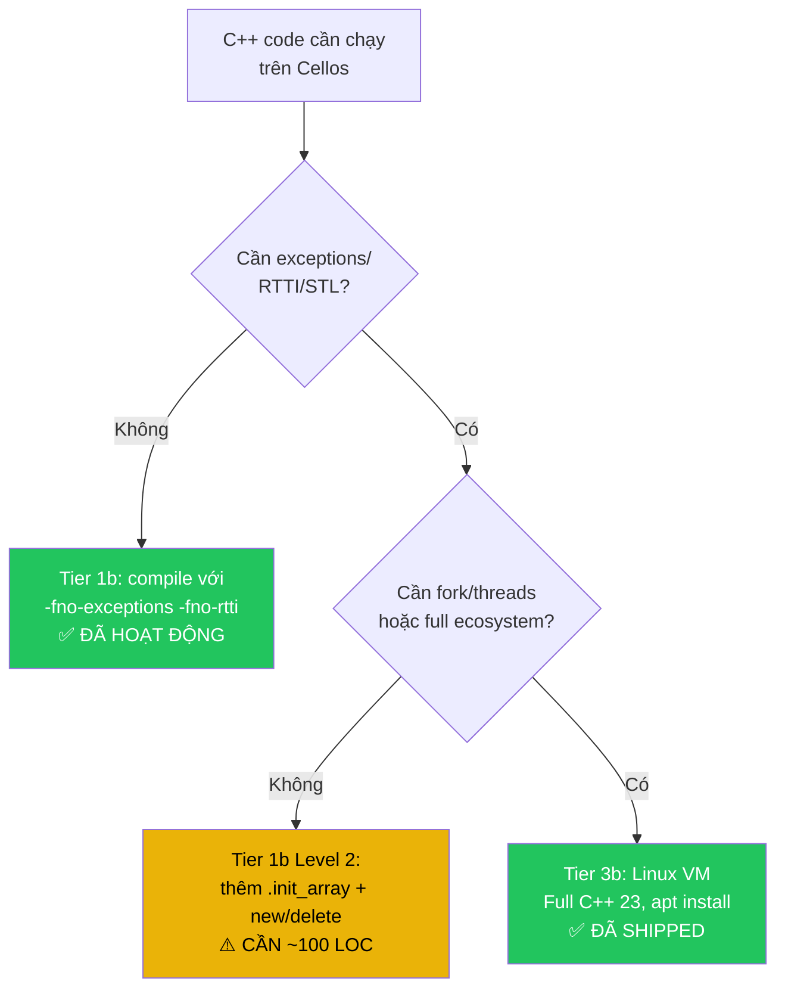

# Phân tích khả năng chạy C++ code trên Cellos

**Version**: 1.0 (Chốt chính sách)  
**Last Updated**: 2026-06-18  
**Status**: Definitive — đã duyệt

## Tóm tắt

Cellos **đã có khả năng chạy C code** (Tier 1b) rất tốt và **C++ freestanding** (`-fno-exceptions -fno-rtti`). **Full C++ (exceptions, RTTI, STL) bắt buộc chạy qua Tier 3b Linux VM** — không port vào SAS cell vì phá vỡ LBI.

> [!IMPORTANT]
> **Chính sách chốt**: C/C++ freestanding cho embedded/robot → **Tier 1b (SAS)**. Full C++ → **Tier 3b Linux VM**. Không có ngoại lệ.

---

## 1. Kiến trúc hiện tại — Những gì ĐÃ CÓ ✅

### 1.1 Hai tầng C library

Cellos có hệ thống **two-tier** cho C library:

| | Tier A: posix.rs | Tier B: mlibc |
|---|---|---|
| **Vị trí** | [libs/api/src/posix.rs](file:///d:/Cellos/libs/api/src/posix.rs) | [third_party/mlibc/](file:///d:/Cellos/third_party/mlibc) |
| **Ngôn ngữ impl** | Rust (`#[no_mangle] extern "C"`) | C++ (mlibc upstream + Cellos sysdeps) |
| **Khả năng** | malloc, strings, file I/O, math, stdio, setjmp | Full POSIX C library (Grisu3 printf, slab allocator) |
| **Build** | Tự động (Rust build) | Cần `bash scripts/build-mlibc.sh` trong WSL2 |
| **Kích thước** | Nhỏ | Lớn hơn |
| **Opt-in** | Mặc định | Feature flag: `api = { features = ["mlibc"] }` |

### 1.2 C code đã chạy thành công

| Project | Loại | Cách link | Status |
|---|---|---|---|
| **DOOM** (doomgeneric) | ~30K LOC C | `cc` crate + picolibc | ✅ Chạy trên compositor |
| **Lua 5.4** | ~15K LOC C | `cc` crate + picolibc/posix.rs | ✅ Chạy REPL |
| **mlibc sysdeps** | C++ (217 LOC) | Meson cross-compile | ✅ Build + link thành công |
| **c-math-smoke** | C symbols qua Rust FFI | posix.rs shim | ✅ 7/7 tests pass |
| **mlibc-smoke** | mlibc C symbols | mlibc-shim | ✅ 3/3 tests pass |

### 1.3 Toolchain hiện có

- **RISC-V**: `riscv-none-elf-gcc` (xpack) — supports C99, picolibc sysroot
- **ARM64**: `aarch64-linux-gnu-gcc` / `aarch64-none-elf-gcc` — cross-compile mlibc
- **x86_64**: `clang` / `x86_64-elf-gcc` — fallback nếu có
- **Build system**: Rust `cc` crate (biên dịch .c files) + Meson (mlibc)
- **Linker**: `rust-lld` (LD.LLD) — handles ELF linking
- **Syscall ABI**: [Cellos/syscall.h](file:///d:/Cellos/third_party/mlibc/sysdeps/Cellos/include/Cellos/syscall.h) — riscv64 + aarch64

### 1.4 Entry point flow

```
ostd::_start (assembly, naked)
  → call main (Rust cell's #[no_mangle] pub fn main())
    → extern "C" { fn c_function(); }  ← FFI call vào C/C++ code
  → sys_exit(0)
```

---

## 2. Phân tích chi tiết — C++ cần gì?

### 2.1 C++ "subset" ĐÃ HOẠT ĐỘNG ✅

Những tính năng C++ **không cần runtime support** đều hoạt động:

- ✅ **C++ classes** (structs with methods, constructors, destructors inline)
- ✅ **Templates** (compile-time, header-only)
- ✅ **Namespaces** (chỉ là name mangling)
- ✅ **References** (syntactic sugar cho pointers)
- ✅ **`constexpr` / `consteval`** (compile-time)
- ✅ **Lambda** (closure objects, no heap)
- ✅ **Overloading** (resolved at compile-time)
- ✅ **`static_cast` / `reinterpret_cast`** (no runtime)
- ✅ **C++17 structured bindings, `if constexpr`, `std::optional` header-only**

**Bằng chứng**: mlibc sysdeps đã sử dụng C++ namespaces, `constexpr`, `[[noreturn]]`, `__attribute__`, `nullptr` — tất cả compile và link thành công:

```cpp
// third_party/mlibc/sysdeps/Cellos/generic/generic.cpp
namespace mlibc {
    static constexpr size_t ARENA_SIZE = 4 * 1024 * 1024;
    [[noreturn]] void sys_libc_panic() { ... }
}
```

### 2.2 C++ features THIẾU runtime support

| Feature | Cần gì | Hiện tại | Verdict |
|---|---|---|---|
| **Global constructors** (`.init_array`) | CRT startup gọi `__libc_init_array()` | ❌ `_start` skip | ✅ **Sẽ bổ sung** (~25 LOC) |
| **`new` / `delete`** | `operator new` → `malloc` | ⚠️ Cần thêm glue | ✅ **Sẽ bổ sung** (~20 LOC) |
| **`__cxa_pure_virtual`** | Abort handler | ❌ Không có | ✅ **Sẽ bổ sung** (~5 LOC) |
| **`__cxa_guard_*`** | Static local init | ❌ Không có | ✅ **Sẽ bổ sung** (~15 LOC) |
| **Global destructors** (`.fini_array`) | `atexit()` + CRT shutdown | ❌ Không có | ❌ **LOẠI BỎ** — SAS unsafe (xem §7) |
| **Exceptions** (`throw/catch`) | `libunwind` + `__cxa_throw` | ❌ Không có | ❌ **LOẠI BỎ** — SAS unsafe (xem §7) |
| **RTTI** (`dynamic_cast`, `typeid`) | `__cxa_*` runtime, `typeinfo` vtable | ❌ Không có | ❌ **LOẠI BỎ** — SAS unsafe (xem §7) |
| **STL** (`std::string`, `std::vector`...) | `libstdc++` hoặc `libc++` | ❌ Không có | ❌ **LOẠI BỎ** — SAS unsafe (xem §7) |
| **`<thread>` / `<mutex>`** | pthreads | ❌ SAS incompatible | ❌ **LOẠI BỎ** — by design |
| **`<filesystem>`** | Full POSIX FS | ❌ Thiếu nhiều | ❌ **LOẠI BỎ** — dùng Tier 3b |

### 2.3 Chi tiết từng thành phần thiếu

#### A. Global Constructors — `.init_array` (✅ Sẽ bổ sung)

C global/C++ objects cần constructors chạy trước `main()`:
```cpp
static MyClass global_obj;  // constructor cần chạy trước main()
```

**Vấn đề**: [ostd startup.rs](file:///d:/Cellos/libs/ostd/src/startup.rs) gọi `call main` trực tiếp mà **không** iterate `.init_array`.

**Fix**: Thêm ~25 LOC vào startup.rs (3 arches) + `.init_array` section vào linker scripts.

> [!WARNING]
> **`.fini_array` KHÔNG được thêm.** Cell bị kill → destructors không chạy → tạo false sense of cleanup. Kernel reclaims tất cả resources qua zombie reaper.

#### B. `operator new` / `operator delete` (✅ Sẽ bổ sung)

Wrapper quanh malloc/free đã có. BẮT BUỘC `-fno-exceptions` nên new **không throw** (returns nullptr on OOM).

#### C. Exceptions (❌ LOẠI BỎ — SAS unsafe)

**Quyết định**: `-fno-exceptions` là BẮT BUỘC. Không port `libunwind`.

**Lý do**: Stack unwinding trong SAS có thể đi lạc sang cell khác, hot-swap khiến unwind tables trỏ về code đã free → use-after-free trong kernel space. Xem chi tiết tại §7 Lý do 2.

#### D. STL / C++ Standard Library (❌ LOẠI BỎ — dùng alternatives)

**Quyết định**: Không port `libc++` hoặc `libstdc++` (170K-330K LOC unsafe trong SAS).

**Alternatives cho embedded/robot**:
- Header-only: `<array>`, `<optional>`, `<tuple>`, `<type_traits>` — hoạt động ngay
- [ETL (Embedded Template Library)](https://www.etlcpp.com/) — fixed-capacity containers, no heap
- Full C++ ecosystem → Tier 3b Linux VM

---

## 3. Mức độ hỗ trợ C++ — 3 tiers

### Level 1: C++ "freestanding" (ĐÃ HOẠT ĐỘNG ✅)

```
Compile flags: -fno-exceptions -fno-rtti -nostdlib -ffreestanding
Hỗ trợ: classes, templates, namespaces, constexpr, lambdas, references
Thiếu: STL containers, exceptions, RTTI, global ctors
Use case: vendor SDK (RKNN, Hailo), codec libraries, math libraries
```

> **Đây là level hiện tại — hoạt động tốt qua `cc` crate.**

### Level 2: C++ "embedded+" (CẦN BỔ SUNG — 🟢 ~84 LOC)

```
Thêm: .init_array, operator new/delete, __cxa_pure_virtual, __cxa_guard_*
Compile flags: -fno-exceptions -fno-rtti -fno-unwind-tables
Hỗ trợ: Level 1 + global C++ objects + heap allocation + ETL containers
Use case: robot control firmware C++, game engines (DOOM-class), sensor fusion
KHÔNG có: .fini_array, atexit, exceptions, RTTI, STL, pthreads
```

> **Bổ sung cần**: ~84 LOC (xem §8 chi tiết)

### Level 3: Full C++ → Tier 3b Linux VM (ĐÃ CÓ ✅)

```
Dùng: Tier 3b Linux VM (shipped ARM64 EL2, P01-P10)
Hỗ trợ: Full C++ 23 (std::string, std::vector, exceptions, RTTI, pthreads)
Use case: complex C++ frameworks, ROS2 nodes, full game engines
Cách dùng: apt install g++ → compile → chạy trong VM
```

> **KHÔNG port full C++ runtime vào SAS cell.** Xem §7 cho phân tích chi tiết.

---

## 4. Đề xuất bổ sung — Đã rà soát SAS-safety

> [!IMPORTANT]
> Các đề xuất dưới đây đã được rà soát qua SAS-safety audit. Các hàm gây mất an toàn cho LBI đã bị loại bỏ.

### 4.1 Các item SẼ BỔ SUNG (SAS-safe)

| # | Task | File | LOC | SAS-safe? |
|---|---|---|---|---|
| 1 | `.init_array` iteration (global constructors) | [startup.rs](file:///d:/Cellos/libs/ostd/src/startup.rs) + linker scripts | ~25+6 | ✅ Chỉ chạy function pointers |
| 2 | `operator new/delete` (6 variants) | [alloc.rs](file:///d:/Cellos/libs/api/src/posix/alloc.rs) | ~20 | ✅ Wrapper quanh malloc/free |
| 3 | `__cxa_pure_virtual` → `abort()` | `posix/cxxabi.rs` [NEW] | ~5 | ✅ Panic handler |
| 4 | `__cxa_guard_acquire/release/abort` | `posix/cxxabi.rs` [NEW] | ~15 | ✅ Simple flag (single-threaded) |
| 5 | `abort()` | `posix/cxxabi.rs` [NEW] | ~5 | ✅ Calls `sys_exit(134)` |
| 6 | Module wiring | [posix.rs](file:///d:/Cellos/libs/api/src/posix.rs) | ~3 | ✅ |
| | **Tổng** | | **~84** | |

### 4.2 Các item ĐÃ LOẠI BỎ (SAS-unsafe)

| # | Item ban đầu | Lý do loại bỏ |
|---|---|---|
| ~~1~~ | `.fini_array` (global destructors) | Cell bị kill → destructors không chạy → false sense of cleanup. Vi phạm never-die supervisor model |
| ~~2~~ | `__cxa_atexit` | Đăng ký cleanup functions nhưng cell bị kill sẽ không gọi chúng. Misleading |
| ~~3~~ | `libc++abi` (no exceptions) | Kéo theo RTTI global registry → cross-cell pointers → SAS unsafe |
| ~~4~~ | `libc++` / `libstdc++` | 150K-300K LOC unsafe trong SAS, phá LBI |
| ~~5~~ | `libunwind` | Stack unwinding cross-cell boundaries → use-after-free |
| ~~6~~ | `__cxa_demangle` | Không cần cho embedded. Dùng host toolchain cho debugging |

---

## 5. Ví dụ: Cách chạy C++ code trên Cellos NGAY BÂY GIỜ

### 5.1 C++ vendor SDK (freestanding — ĐÃ HOẠT ĐỘNG)

```toml
# cells/apps/my-cpp-app/Cargo.toml
[package]
name = "my-cpp-app"
edition = "2021"

[dependencies]
api  = { path = "../../../libs/api" }
ostd = { path = "../../../libs/ostd" }

[build-dependencies]
cc = "1.0"
```

```rust
// cells/apps/my-cpp-app/build.rs
fn main() {
    cc::Build::new()
        .cpp(true)                     // ← compile as C++
        .compiler("riscv-none-elf-g++") // ← C++ compiler
        .flag("-fno-exceptions")
        .flag("-fno-rtti")
        .flag("-std=c++17")
        .file("src/c/my_lib.cpp")
        .compile("mylib");
}
```

```rust
// cells/apps/my-cpp-app/src/main.rs
#![no_std]
#![no_main]
extern crate api;
extern crate ostd;

extern "C" {
    fn cpp_process_data(input: *const u8, len: usize) -> i32;
}

#[no_mangle]
pub fn main() {
    let data = [1u8, 2, 3, 4];
    let result = unsafe { cpp_process_data(data.as_ptr(), data.len()) };
    ostd::io::println_fmt(format_args!("Result: {}", result));
}
```

### 5.2 C++ code cần `new`/`delete` (SAU KHI bổ sung Level 2)

```cpp
// src/c/robot_controller.cpp
// Compile với: -fno-exceptions -fno-rtti -std=c++17

class PIDController {
    float kp, ki, kd;
    float integral = 0;
    float prev_error = 0;
public:
    PIDController(float p, float i, float d) : kp(p), ki(i), kd(d) {}
    float compute(float error, float dt) {
        integral += error * dt;
        float derivative = (error - prev_error) / dt;
        prev_error = error;
        return kp * error + ki * integral + kd * derivative;
    }
};

static PIDController* controller = nullptr;  // cần global ctor + new

extern "C" void robot_init() {
    controller = new PIDController(1.0f, 0.1f, 0.01f);
}

extern "C" float robot_update(float error, float dt) {
    return controller->compute(error, dt);
}
```

---

## 6. Kết luận phần 1

| Câu hỏi | Trả lời |
|---|---|
| C code chạy được không? | ✅ **Đã chạy tốt** (DOOM, Lua, vendor SDK) |
| C++ freestanding chạy được không? | ✅ **Đã hoạt động** (`-fno-exceptions -fno-rtti`) |
| C++ với `new`/global objects? | ⚠️ **Cần bổ sung ~84 LOC** (Level 2) |
| C++ đầy đủ (STL, exceptions)? | ❌ **Bắt buộc Tier 3b Linux VM** — không port vào SAS |
| Exceptions, RTTI, STL? | ❌ **LOẠI BỎ** — phá vỡ LBI, SAS unsafe (xem §7) |


# Tại sao không nên port Full C++ Runtime lên Cellos

## Tóm tắt một câu

> **Full C++ (exceptions + RTTI + STL + libunwind) phá vỡ 5/8 Coding Laws, biến Cellos từ "Rust-safe SAS OS" thành "yet another C++ RTOS" — đánh mất lợi thế kiến trúc duy nhất so với QNX/VxWorks/Zephyr.**

---

## Lý do 1: Phá vỡ Language-Based Isolation — nền tảng kiến trúc duy nhất

### Vấn đề cốt lõi

Cellos **không có hardware MMU isolation giữa các cells**. Theo [12-reliability.md §2](file:///d:/Cellos/docs/specs/12-reliability.md):

> *"Per-Cell SATP isolation at Tier 1 is NOT pursued. [...] Hardware isolation is delivered by Tier 3 Stage-2 paging (per-VM), not smeared across every Tier-1 cell."*

Điều này có nghĩa **Rust type system là HÀNG RÀO DUY NHẤT** ngăn một cell phá hủy cell khác. Theo [01-core.md](file:///d:/Cellos/docs/specs/01-core.md):

> *"Cellos dịch chuyển từ cách ly bằng phần cứng sang Language-Based Isolation (LBI) để triệt tiêu chi phí IPC."*

### C++ phá vỡ LBI như thế nào

Full C++ runtime đưa vào SAS hàng chục ngàn dòng **memory-unsafe code**:

| Component | LOC (approx) | unsafe operations |
|---|---|---|
| `libstdc++` / `libc++` | 150K–300K | `new`/`delete`, raw pointer arithmetic, type punning |
| `libunwind` | 5K–15K | Stack walking, register manipulation, signal handling |
| `libcxxabi` | 8K–12K | `dynamic_cast` (pointer arithmetic), `__cxa_throw` (longjmp-like) |
| **Tổng** | **~170K–330K LOC C/C++** | **Toàn bộ memory-unsafe** |

So sánh: kernel Cellos **toàn bộ** chỉ ~18K LOC Rust. Port full C++ sẽ đưa vào SAS lượng code unsafe **gấp 10-18× kernel** — chạy cùng address space, không có MMU barrier.

### Research xác nhận

[research-backed-proposals.md](file:///d:/Cellos/docs/research/research-backed-proposals.md) (CHERIoT SOSP 2025 + NSA/CISA 2025):

> *"C/C++ gây ~70% critical security vulnerabilities — không thể fix bằng tooling, chỉ fix bằng language swap."*

Và quan trọng hơn — research adversarial verification:

> **❌ "Rust type system đủ để làm SAS an toàn" — BÁC BỎ 3-0.** Tức là Rust alone chưa đủ — cần Memory Ownership Registry + unsafe budget enforcement bổ sung.

Nếu Rust **alone** đã chưa đủ an toàn cho SAS, thì thêm 300K LOC C++ unsafe vào cùng SAS là **tự hủy nền tảng**.

---

## Lý do 2: Exceptions phá vỡ SAS Memory Safety

### Stack unwinding trong SAS = thảm họa

C++ exceptions hoạt động bằng cách **unwinding the call stack** — đi ngược qua stack frames, gọi destructors, tìm catch handler. Cơ chế này **giả định process model truyền thống**:

```
[Traditional OS — mỗi process có address space riêng]
  throw MyException()
    → libunwind walks stack frames (chỉ trong process này)
    → destructors chạy (chỉ objects của process này)
    → nếu crash: chỉ process này chết

[Cellos SAS — mọi cell chung address space]
  throw MyException()
    → libunwind walks stack frames (TOÀN BỘ SAS)
    → nếu unwind table bị corrupt → stack walker đi lạc sang cell khác
    → nếu destructor use-after-free → writes vào memory của kernel/cell khác
    → KHÔNG CÓ MMU ngăn chặn → silent data corruption toàn hệ thống
```

### Exception unwinding cần metadata mà Cellos không kiểm soát

`.gcc_except_table` và `.eh_frame` sections chứa **dwarf unwind information** — metadata hướng dẫn libunwind cách walk stack. Metadata này:

- Được compiler tự generate (Cellos không audit được)
- Chứa PC-relative offsets (đúng lúc link, sai nếu hot-swap di chuyển code)
- Giả định contiguous stack (SAS stack guard pages có thể gây confuse)

### Hot-swap + exceptions = undefined behavior

[03-runtime.md §3](file:///d:/Cellos/docs/specs/03-runtime.md) mô tả hot-swap:

> 1. Kernel đóng băng OldCell
> 2. Gọi `serialize_state()`
> 3. Nạp NewCell, gọi `deserialize_state(blob)`
> 4. **Tráo đổi con trỏ hàm (Symbol Re-linking)** và giải phóng OldCell

Nếu exception đang mid-flight khi hot-swap xảy ra → unwind tables trỏ về OldCell code đã bị free → **use-after-free**, **trực tiếp trong SAS kernel space**.

---

## Lý do 3: RTTI phá vỡ "Owned Buffers" — Law 2

### Law 2 tồn tại vì SAS

[CLAUDE.md](file:///d:/Cellos/CLAUDE.md) Law 2:

> ❌ FORBIDDEN: `async fn process(data: &mut [u8])`
> ✅ REQUIRED: `async fn process(data: Box<[u8]>) -> Box<[u8]>`
> **Why**: Prevent lifetime violations in Single Address Space

C++ RTTI (`dynamic_cast`, `typeid`) duy trì **global type registry** — một bảng toàn cục chứa pointers đến typeinfo objects. Trong SAS:

1. **Typeinfo objects cross cell boundaries** — `dynamic_cast` giữa objects thuộc cells khác nhau sẽ dereference pointers vào cell khác
2. **Cell death → dangling typeinfo** — nếu cell A tạo object, cell B giữ typeinfo reference, cell A bị kill → B crash khi `dynamic_cast`
3. **Typeinfo không implement Drop** — vi phạm Law 8 (RAII)

---

## Lý do 4: Phá vỡ Never-Die Reliability Model

### Supervisor restart không hoạt động với C++ global state

[12-reliability.md §4.3](file:///d:/Cellos/docs/specs/12-reliability.md) mô tả recovery model:

> *"Erlang/OTP-style 'let it crash + restart'. init auto-restarts services."*

Mô hình này hoạt động vì Rust cells **stateless by design** (Law 2) — restart = load fresh ELF + init. Nhưng full C++:

- **Global constructors** (`.init_array`) tạo global state ẩn — restart cần re-run chúng trong đúng thứ tự
- **`atexit()` handlers** — không chạy nếu cell bị kill (SIGKILL-equivalent)
- **Static locals** (`Meyer's singleton`) — thread-safe init via `__cxa_guard_acquire` giả định pthreads
- **C++ static destructors** — thứ tự destruction ngược lại construction, nhưng construction order không deterministic across translation units

### libstdc++ internal state leaks on restart

`libstdc++` duy trì internal heap pools, free lists, và thread-local caches. Khi cell bị kill:
- Free lists trỏ về memory đã được kernel reclaim
- Thread-local caches (nếu có) không được cleanup
- Internal mutexes (nếu có) ở state locked → deadlock khi restart

So sánh: posix.rs Tier A shim **không có internal state** — restart hoàn toàn clean.

---

## Lý do 5: Footprint không phù hợp G1 (Robot/Embedded)

### Số liệu thực tế

| Component | Binary size (stripped, riscv64) |
|---|---|
| Cellos kernel | ~100–200 KB |
| Tier A posix.rs shim | ~1,405 LOC Rust → ~15-25 KB |
| mlibc Tier B (minimal) | ~50-100 KB |
| **libstdc++** (minimal) | **~2-5 MB** |
| **libc++ + libcxxabi** | **~1-3 MB** |
| **libunwind** | **~100-200 KB** |
| **Tổng C++ runtime** | **~3-8 MB** |

G1 target profile ([05-application.md §5](file:///d:/Cellos/docs/specs/05-application.md)):

> **Cellos-Nano**: Tier 1 | RV32, <512KB | MCU, motor/sensor control
> **Cellos-Standard**: Tier 1 + 1b + 3a | RV64/ARM64 SBC | Robot brain, edge AI

Full C++ runtime **lớn hơn toàn bộ Cellos-Nano profile** — một component duy nhất vượt quá budget cả hệ thống.

### Mỗi KB tốn ở 3 nơi trong SAS

Trong OS truyền thống, shared library load 1 lần, map vào N processes. Trong Cellos SAS, C++ runtime phải link **statically** vào mỗi cell (dynamic linking không supported). 5 cells dùng C++ = 5× bản copy của libstdc++ trong cùng address space.

---

## Lý do 6: Alternatives đã có — và tốt hơn

### Cho code cần C++ freestanding (ĐÃ CÓ ✅)

```
Compile với: -fno-exceptions -fno-rtti -nostdlib++
→ Classes, templates, namespaces, constexpr, lambdas hoạt động
→ Đây là cách mlibc sysdeps chạy ngay bây giờ
→ Zero thêm risk vào SAS
```

### Cho code cần full C++ ecosystem (ĐÃ CÓ ✅)

```
Tier 3b Linux VM (shipped, ARM64 EL2, P01-P10):
→ apt install g++ → full C++ 23 support
→ Hardware Stage-2 isolation (VTTBR_EL2)
→ Untrusted code OK
→ fork/exec/threads/exceptions/RTTI — tất cả hoạt động
→ 2-10s boot time (acceptable cho non-RT workloads)
```

### Bảng so sánh chi phí/lợi ích

| | Port Full C++ vào Cell | Dùng Tier 3b Linux VM |
|---|---|---|
| **Effort** | 2-4 tuần (port) + ongoing maintenance | 0 (đã shipped) |
| **Risk cho SAS** | 🔴 Cao (300K LOC unsafe in SAS) | 🟢 Zero (Stage-2 fence) |
| **Performance** | 100% native | ~85-90% native |
| **C++ version** | Subset (sẽ luôn thiếu gì đó) | Full C++ 23+ |
| **fork/threads** | ❌ Không bao giờ (SAS incompatible) | ✅ Full support |
| **Ecosystem** | Cần port từng library | `apt install` — hàng triệu packages |
| **Maintenance** | Cellos team tự maintain | Linux community maintain |

---

## Lý do 7: Bài học từ Theseus OS

[research-theseus-os.md F5](file:///d:/Cellos/docs/research/research-theseus-os.md) phân tích tại sao Theseus (cùng kiến trúc SAS+LBI) không ship production:

> *"Pure-Rust mandate: Bất kỳ C/C++ library nào (curl, OpenSSL, SQLite) đều breaks compiler knowledge chain. Đây là architectural fundamental, không phải gap tạm thời."*

Cellos đã giải quyết vấn đề này tốt hơn Theseus bằng **Tier 1b** (C FFI có kiểm soát) — nhưng chỉ cho **C code freestanding**, không phải full C++ runtime. Tier 1b hoạt động **vì scope nhỏ, auditable**:

| | Tier 1b (C freestanding) | Full C++ runtime |
|---|---|---|
| LOC unsafe trong SAS | ~100-5,000 (per library) | ~170,000-330,000 |
| Auditable? | ✅ Có thể review | ❌ Không thực tế |
| Side effects ẩn | Ít (C functions are explicit) | Nhiều (constructors, destructors, RTTI, exceptions) |
| Internal state | Không (stateless shim) | Có (allocator pools, thread-local, type registry) |

---

## Tổng hợp: 8 Coding Laws bị vi phạm

| Law | Full C++ vi phạm? | Chi tiết |
|---|---|---|
| **Law 1**: Interface is Sacred | ⚠️ Gián tiếp | C++ name mangling + typeinfo phá stable ABI |
| **Law 2**: Owned Buffers | 🔴 **Vi phạm** | RTTI global registry + exception state cross cell boundaries |
| **Law 3**: Multi-Architecture | ⚠️ Gián tiếp | libunwind/libcxxabi cần port per-arch (RV32 chưa có upstream support) |
| **Law 4**: Unsafe Management | 🔴 **Vi phạm** | 300K LOC unsafe C++ code trong SAS, không thể `#![forbid(unsafe_code)]` |
| **Law 5**: Modern Module Style | ✅ OK | Không liên quan |
| **Law 6**: Cellos Naming | ✅ OK | Không liên quan |
| **Law 7**: Trait Objects | 🔴 **Vi phạm** | C++ vtable format khác Rust vtable — cross-language polymorphism không an toàn |
| **Law 8**: RAII - Implement Drop | 🔴 **Vi phạm** | C++ destructors không tích hợp với Rust Drop — cell death không cleanup C++ objects |

**4/8 Laws bị vi phạm trực tiếp.** Đây không phải bugs có thể fix — đây là **xung đột kiến trúc fundamental**.

---

## Kết luận: "Đúng Tier cho đúng việc"



> [!CAUTION]
> **Port full C++ runtime vào Tier 1 cell** không phải là vấn đề kỹ thuật (có thể làm được) — mà là vấn đề **kiến trúc**. Nó biến Cellos từ "Rust-safe SAS OS differentiated by LBI" thành "C++ embedded OS giống VxWorks/QNX nhưng KHÔNG CÓ hardware isolation." Đó là worst of both worlds.

---

## 8. POSIX Shim SAS-Safety Audit

Rà soát toàn bộ hàm trong [libs/api/src/posix/](file:///d:/Cellos/libs/api/src/posix) đánh giá an toàn cho SAS.

### 8.1 AN TOÀN — Giữ nguyên

| Module | Hàm | Lý do an toàn |
|---|---|---|
| [alloc.rs](file:///d:/Cellos/libs/api/src/posix/alloc.rs) | `malloc`, `free`, `realloc`, `calloc` | Cell-local heap, magic header validation, null-safe |
| [math.rs](file:///d:/Cellos/libs/api/src/posix/math.rs) | `sin`, `cos`, `sqrt`, `pow`, `log`, `atan2`, ... | Pure functions (Rust libm), zero side effects |
| [entropy.rs](file:///d:/Cellos/libs/api/src/posix/entropy.rs) | `getentropy`, `arc4random_buf` | Syscall wrapper, 256-byte limit enforced |
| [stdio.rs](file:///d:/Cellos/libs/api/src/posix/stdio.rs) | `printf`, `fprintf`, `snprintf`, `fopen`, `fclose`, `fread`, `fwrite` | Syscall wrappers, stack-bounded buffers (1024 bytes) |
| [sysio.rs](file:///d:/Cellos/libs/api/src/posix/sysio.rs) | `_open`, `_read`, `_write`, `_close`, `_lseek`, `_exit`, `_time` | Direct syscall wrappers, kernel validates args |
| [strings.rs](file:///d:/Cellos/libs/api/src/posix/strings.rs) | `memcpy`, `memmove`, `memset`, `memcmp`, `strlen`, `strcmp`, `strncmp`, `memchr` | Bounded operations, standard C semantics |
| [net.rs](file:///d:/Cellos/libs/api/src/posix/net.rs) | `socket`, `connect`, `send`, `recv`, `_close` | IPC wrappers, atomic fd allocation, bounded buffer |

### 8.2 CẦN GHI CHÚ — Giữ nhưng có rủi ro SAS

| Module | Hàm | Rủi ro SAS | Mitigation |
|---|---|---|---|
| [setjmp.rs](file:///d:/Cellos/libs/api/src/posix/setjmp.rs) | `setjmp` / `longjmp` | `longjmp` có thể nhảy qua stack frames mà không gọi destructors. Nếu `jmp_buf` bị corrupt → nhảy đến địa chỉ tùy ý trong SAS | **GIỮ** — bắt buộc cho Lua (pcall) và DOOM. Chỉ hoạt động trong cùng cell, jmp_buf trên stack |
| [strings.rs](file:///d:/Cellos/libs/api/src/posix/strings.rs) | `strcpy`, `strcat` | **Unbounded copy** — nếu C code truyền buffer nhỏ + string dài → write ngoài bounds trong SAS | **GIỮ** — C code cần. Vendor SDK nên dùng `strncpy`/`strncat` |

### 8.3 Stubs đã đúng (returns -1 / no-op)

| Hàm | Behavior | SAS-correct? |
|---|---|---|
| `_fork` | returns -1 | ✅ SAS incompatible by design |
| `_execve` | returns -1 | ✅ SAS incompatible by design |
| `_kill` | returns -1 | ✅ No signals in SAS |
| `_wait` | returns -1 | ✅ No child processes |
| `_sbrk` | returns NULL | ✅ Rust allocator owns heap |
| `_link`, `_unlink` | returns -1 | ✅ VFS handles via syscall |

---

## 9. BLACKLIST — Tuyệt đối KHÔNG implement trong Tier 1/1b

| Symbol / Feature | Lý do cấm |
|---|---|
| `__cxa_throw` / `__cxa_begin_catch` / `__cxa_end_catch` | Exception unwinding phá SAS (§7 Lý do 2) |
| `__cxa_atexit` | False cleanup promise — cell bị kill không gọi atexit |
| `.fini_array` / `__do_global_dtors_aux` | Destructors không chạy khi cell bị kill. Tạo resource leak ẩn |
| `_Unwind_*` / `__gcc_personality_v0` | libunwind stack walking trong SAS = out-of-bounds reads |
| `__dynamic_cast` / `typeid` | RTTI global registry cross cell boundaries |
| `dlopen` / `dlsym` / `dlclose` | Dynamic linking phá SAS address layout + code signing |
| `pthread_*` | SAS cells là single-threaded. pthreads = shared mutable state cross-cell |
| `signal` / `sigaction` / `raise` | Signals phá cell isolation model — dùng IPC |
| `mmap(MAP_SHARED)` | Shared memory bypass kernel ownership tracking |
| `fork` / `exec` / `system` | SAS incompatible by design (đã stub returns -1) |

---

## 10. Compile flags BẮT BUỘC cho C++ trong Tier 1b

```bash
# BẮT BUỘC cho mọi C++ code trong Cellos cell:
-fno-exceptions                    # exceptions phá SAS
-fno-rtti                          # RTTI global registry cross-cell
-fno-unwind-tables                 # không emit .eh_frame (SAS unsafe)
-fno-asynchronous-unwind-tables    # không emit .eh_frame_hdr
-nostdlib                          # dùng posix.rs shim, không system libc
-ffreestanding                     # không giả định hosted environment

# KHUYẾN NGHỊ:
-fno-threadsafe-statics            # single-threaded cell, skip guard overhead
-std=c++17                         # hoặc c++20 — compiler features OK
```

Template `build.rs` đầy đủ:

```rust
fn main() {
    cc::Build::new()
        .cpp(true)
        .compiler("riscv-none-elf-g++")  // hoặc aarch64-none-elf-g++
        .flag("-std=c++17")
        .flag("-fno-exceptions")
        .flag("-fno-rtti")
        .flag("-fno-unwind-tables")
        .flag("-fno-asynchronous-unwind-tables")
        .flag("-ffreestanding")
        .flag("-nostdlib")
        .warnings(false)
        .file("src/c/my_code.cpp")
        .compile("mylib");
}
```

---

## 11. Chính sách chốt cuối cùng

```
┌─────────────────────────────────────────────────────────────────┐
│                    Cellos C/C++ Policy                          │
├─────────────────────────────────────────────────────────────────┤
│                                                                 │
│  Tier 1b (SAS — in-cell):                                      │
│    ✅ C code (malloc, stdio, file I/O, math, strings)          │
│    ✅ C++ freestanding (-fno-exceptions -fno-rtti)              │
│    ✅ operator new/delete (→ malloc/free)                       │
│    ✅ .init_array (global constructors, C-style)                │
│    ✅ __cxa_pure_virtual (→ abort)                              │
│    ✅ __cxa_guard_* (trivial single-threaded)                   │
│    ✅ setjmp/longjmp (Lua/DOOM — documented risk)              │
│    ❌ exceptions, RTTI, STL, libunwind, pthreads               │
│    ❌ .fini_array, atexit, signals, dlopen, fork               │
│                                                                 │
│  Tier 3b (Linux VM — hardware-isolated):                       │
│    ✅ Full C++ 23                                               │
│    ✅ exceptions, RTTI, STL, pthreads                           │
│    ✅ fork, exec, signals, mmap                                 │
│    ✅ apt install any library                                   │
│                                                                 │
└─────────────────────────────────────────────────────────────────┘
```

> [!TIP]
> **Đường đi đúng:** Đầu tư vào Level 2 C++ freestanding (~84 LOC) để cover 90% use cases embedded/robot, và dùng Tier 3b Linux VM cho 10% còn lại. Không bao giờ đưa full C++ runtime vào SAS.
